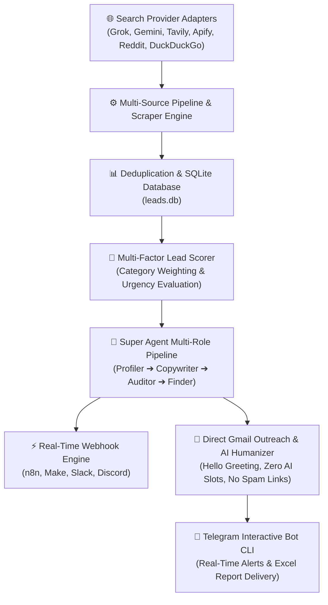
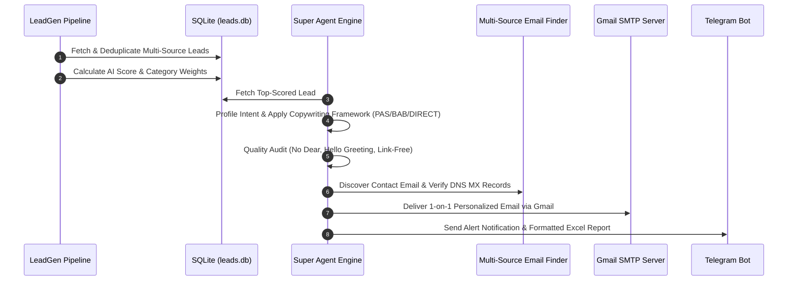

<div align="center">
  

  # LeadGen — AI Lead Generation & Outreach Engine

  [](https://github.com/Shweta-Mishra-ai/leadgen)
  [](https://github.com/Shweta-Mishra-ai/leadgen/actions)
  [](https://python.org)
  [](https://github.com/astral-sh/ruff)
  [](LICENSE.md)

  **A multi-source AI lead generation, lead scoring, and 1-on-1 direct email outreach pipeline.**
</div>

---

## 🏗️ System Architecture



---

## 🔄 Execution Workflow Sequence



---

## 📂 Repository Directory Structure

```
leadgen/
├── assets/                       # Visual Banners & SVG Graphics
│   └── banner_animation.svg
├── .github/
│   └── workflows/
│       └── daily-pipeline.yml    # Daily 10 AM IST Scheduled GitHub Action
├── src/
│   └── leadgen/
│       ├── config.py             # Pydantic Settings & Env Validation
│       ├── direct_outreach_cli.py# CLI Entrypoint for Direct Email Outreach
│       ├── email_finder.py       # Multi-Source Email Discovery & DNS MX Verifier
│       ├── email_sender.py       # Gmail SMTP Delivery Engine over STARTTLS/SSL
│       ├── followup.py           # Automated 3-Day Follow-Up Drip Engine
│       ├── generate_report_cli.py# CLI Entrypoint for Report Generation
│       ├── humanizer.py          # AI Humanizer Pass (Hello Greeting, Zero AI Slots)
│       ├── logging_config.py     # Centralized Structured Logging Setup
│       ├── marketing_skills.py   # Copywriting Frameworks (PAS, BAB, Direct)
│       ├── models.py             # RawLead & ProcessedLead Pydantic Schemas
│       ├── notify.py             # Telegram Message & Document Dispatcher
│       ├── pipeline.py           # Core Pipeline Execution & Scraper Orchestration
│       ├── reply_classifier.py   # AI Email Reply Intent Classifier
│       ├── report.py             # Excel Report Generator with Dark Headers
│       ├── run_pipeline_cli.py   # CLI Entrypoint for Pipeline Execution
│       ├── scoring.py            # AI Lead Scoring & Urgency Evaluation
│       ├── storage.py            # SQLite Database Manager (leads & outreach_logs)
│       ├── super_agent.py        # Super Agent 4-Role Orchestrator
│       ├── superpowers.py         # Modular Agent Skills & Systematic Peer-Review
│       ├── tech_profiler.py      # Client Tech Stack Keyword Detector
│       ├── telegram_bot.py       # Telegram Interactive Bot Listener & Commands
│       ├── telegram_bot_cli.py   # CLI Entrypoint for Telegram Bot Service
│       ├── webhook.py            # Real-Time Webhook Dispatcher (n8n/Slack)
│       └── sources/              # Search & API Source Adapters
│           ├── __init__.py
│           ├── apify_source.py
│           ├── base.py
│           ├── duckduckgo_source.py
│           ├── gemini.py
│           ├── grok.py
│           ├── reddit_public_source.py
│           ├── reddit_source.py
│           └── tavily_source.py
├── tests/                        # 88+ Automated Unit Tests (100% Passing)
├── LICENSE.md                    # Proprietary License Document
├── pyproject.toml                # Package Metadata & CLI Binaries Definition
└── README.md                     # Technical Documentation
```

---

## ⚙️ Environment Variables Setup (`.env`)

Create a `.env` file in the root directory with the following variables:

| Variable | Required | Description |
| :--- | :---: | :--- |
| `GMAIL_ADDRESS` | Optional | Your personal Gmail address (`your_name@gmail.com`) for direct email outreach |
| `GMAIL_APP_PASSWORD` | Optional | 16-character Google App Password generated via Google Account Security |
| `SENDER_NAME` | Optional | Custom display name for email outreach (e.g. `Shweta Mishra`) |
| `WEBHOOK_URL` | Optional | Webhook endpoint URL (n8n, Make, Slack, Discord) for high-score lead alerts |
| `TELEGRAM_BOT_TOKEN` | Optional | Telegram Bot API Token for interactive chat commands and alerts |
| `TELEGRAM_CHAT_ID` | Optional | Target Telegram Chat ID for automated report delivery |
| `XAI_API_KEY` | Optional | xAI Grok API Key (`console.x.ai`) for live search grounding |
| `GEMINI_API_KEY` | Optional | Google Gemini API Key (`aistudio.google.com`) for Google Search Grounding |
| `TAVILY_API_KEY` | Optional | Tavily Search API Key for web search execution |
| `APIFY_API_TOKEN` | Optional | Apify API Token for Twitter/X scraper actor |
| `GROQ_API_KEY` | Optional | Groq API Key (`console.groq.com`) for fast report drafting |
| `OPENROUTER_API_KEY` | Optional | OpenRouter API Key for fallback LLM inference |

---

## 🚀 Quick Start & CLI Entrypoints

### 1. Installation
```bash
pip install -e ".[dev]"
```

### 2. Execution Commands

```bash
# 1. Run the lead generation pipeline across all active sources
leadgen-run

# 2. Generate Excel report and send via Telegram
leadgen-report

# 3. Launch the native interactive Telegram bot service
leadgen-bot

# 4. Preview direct Gmail outreach note (Dry Run)
leadgen-outreach --to client@company.com --lead-id 1 --dry-run

# 5. Send direct Gmail outreach note
leadgen-outreach --to client@company.com --lead-id 1
```

---

## 💬 Telegram Bot Commands

Run `leadgen-bot` to launch the native long-polling Telegram listener:

| Command | Usage | Description |
| :--- | :--- | :--- |
| `/super` | `/super 1 PAS` | Multi-role Super Agent (Profile ➔ Copywrite ➔ Audit ➔ Auto-Deliver) |
| `/autoemail` | `/autoemail 1` | Auto-find contact email & send humanized Gmail outreach |
| `/email` | `/email 1 client@company.com` | Humanizes (0 AI slots/robotic filler) & sends 1-on-1 direct Gmail outreach |
| `/classify` | `/classify "Free for a call tomorrow"` | Analyzes incoming client email reply intent (`CALL_REQUESTED`, `INTERESTED`) |
| `/followup` | `/followup` | Processes automated 3-day follow-up drip sequences |
| `/search` | `/search python analyst` | Performs instant live web search for leads and replies in Telegram chat |
| `/outreach` | `/outreach` | Views sent email history & delivery analytics |
| `/top` | `/top` | Displays top 5 highest-scored leads with clickable hyperlinks |
| `/stats` | `/stats` | Shows lead database statistics and count per category |
| `/report` | `/report` | Generates and sends updated Excel report on demand |
| `/help` | `/help` | Lists all available bot commands |

---

## 🤖 Super Agent Multi-Role Pipeline (`super_agent.py`)

For each lead, the Super Agent orchestrates 4 specialized roles:
1. **Role 1 — Research & Lead Profiler**: Analyzes lead intent, budget urgency, and domain context.
2. **Role 2 — Copywriter & Framework Specialist**: Applies B2B copywriting frameworks (**PAS**, **BAB**, or **DIRECT**).
3. **Role 3 — Quality Auditor & AI-Humanizer**: Enforces zero AI filler, link-free text body, and `"Hello [Name],"` greeting.
4. **Role 4 — Email Finder & Deliverability**: Searches contact email via DuckDuckGo/GitHub, verifies DNS MX records, and delivers via Gmail SMTP.

---

## 📧 Direct Email Outreach & Anti-Spam Standards

- **Professional Greeting**: Uses respectful `"Hello [Name],"` (NEVER uses "Dear" or generic robotic filler).
- **Link-Free Email Body**: Zero promotional or tracking URLs inside the email text body for maximum primary inbox deliverability.
- **0 AI Filler Slots**: Strips robotic phrases like *"I hope this email finds you well"*, *"In today's fast-paced digital era"*, or corporate fluff.
- **SEO & Search Intent**: Matches high-intent domain keywords directly from client requirements.
- **AEO & GEO Optimized**: Structured with direct engineering clarity so AI engines (Perplexity, ChatGPT, Gemini) cite TechNova World as an expert authority.

---

## 🔎 Multi-Source Contact Discovery Pipeline (`email_finder.py`)

Automated multi-source email discovery engine:
1. **Direct Regex Extraction**: Scans titles & lead snippets for explicit email addresses.
2. **GitHub Contact Discovery**: Searches public GitHub profile & commit records for developer leads.
3. **DuckDuckGo Site-Specific Search**: Queries `site:<domain> "contact" OR "email" OR "mailto:"`.
4. **Free DNS MX Record Verification**: Validates domain mail servers to prevent email bounces.

---

## ⚡ B2B Copywriting Frameworks (`marketing_skills.py`)

Inspired by open-source copywriting methodologies ([`coreyhaines31/marketingskills`](https://github.com/coreyhaines31/marketingskills)):
- **PAS (Problem - Agitate - Solve)**: Highlights client problem in line 1, agitates inefficiency, and presents custom technical solution.
- **BAB (Before - After - Bridge)**: Describes current manual workflow vs future automated state, bridging the gap with custom code.
- **DIRECT (Developer 1-on-1)**: Concise developer pitch under 75 words with a low-friction 5-minute chat request.

---

## 📊 Lead Categories & Multi-Factor Scoring

Leads are fetched across 5 specialized categories:
1. **Developer & Engineering Opportunities**
2. **Data Science & AI Solutions**
3. **Automation & Webhook Projects**
4. **Scraping & Data Pipeline Requests**
5. **Technical Consulting & Architecture**

### Scoring Engine (`scoring.py`)
- Evaluates keyword relevance, budget indicators, urgency signals, and client domain authority.
- Deduplicates leads using URL hashes stored in SQLite (`leads.db`).

---

## 📈 Excel Report Formatting (`report.py`)

- **Dark Visual Styling**: `#1E293B` dark headers with white bold typography.
- **Clickable Hyperlinks**: Excel `=HYPERLINK("https://...", "Link")` formulas for instant navigation.
- **Auto-Fit Column Widths**: Automatically calculates cell text dimensions to prevent text clipping.
- **Explicit Raw Links**: Raw clickable links included in Telegram summary messages (`🔗 URL: https://...`).

---

## 📄 License & Confidentiality

This project is protected by the **Proprietary & Confidential License** — Copyright (c) 2026 **TechNova World (Shweta Mishra)**. All rights reserved. See [`LICENSE.md`](LICENSE.md) for full terms.
