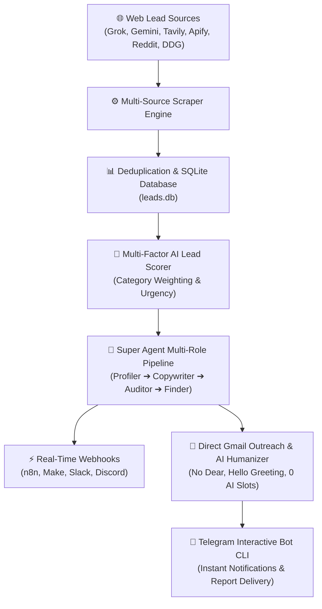
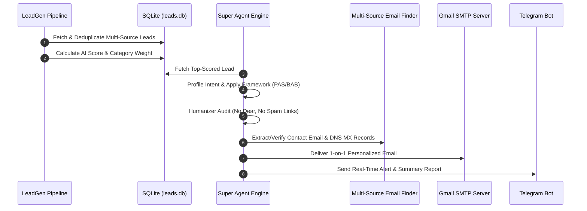

<div align="center">
  

  # 🚀 LeadGen 2.0 — Autonomous AI Lead Generation & Outreach Engine

  [](https://github.com/Shweta-Mishra-ai/leadgen/actions)
  [](https://python.org)
  [](https://github.com/astral-sh/ruff)
  [](LICENSE.md)

  **An enterprise-grade, multi-source AI lead generation, scoring, and automated direct outreach platform.**
</div>

---

## 🏗️ System Architecture



---

## 🔄 Execution Workflow Sequence



---

## 📂 Repository Folder Structure

```
leadgen/
├── assets/                       # Animated SVG Banner & Visual Assets
│   └── banner_animation.svg
├── .github/
│   └── workflows/
│       └── daily-pipeline.yml    # Daily 10 AM IST Scheduled GitHub Action
├── src/
│   └── leadgen/
│       ├── config.py             # Pydantic Settings & Env Validation
│       ├── direct_outreach_cli.py# Command-line entrypoint for Gmail outreach
│       ├── email_finder.py       # Multi-source email finder & MX verifier
│       ├── email_sender.py       # Gmail SMTP delivery engine over TLS/SSL
│       ├── followup.py           # Automated 3-day follow-up drip campaign
│       ├── humanizer.py          # AI Humanizer pass (Zero AI filler, Hello greeting)
│       ├── marketing_skills.py   # Copywriting frameworks (PAS, BAB, Direct)
│       ├── models.py             # RawLead & ProcessedLead Pydantic models
│       ├── pipeline.py           # Core scraper execution pipeline
│       ├── reply_classifier.py   # AI Email reply intent classifier
│       ├── report.py             # Excel report generator & formatting
│       ├── scoring.py            # AI Lead scoring & urgency evaluation
│       ├── storage.py            # SQLite database manager (leads & outreach)
│       ├── super_agent.py        # Super Agent 4-Role orchestration pipeline
│       ├── superpowers.py         # Modular agent skills & peer-review auditor
│       ├── tech_profiler.py      # Technical stack keyword detector
│       ├── telegram_bot.py       # Interactive Telegram bot handler
│       ├── webhook.py            # Real-time webhook dispatcher (n8n/Slack)
│       └── sources/              # API & Search Provider Adapters
│           ├── apify_source.py
│           ├── duckduckgo_source.py
│           ├── gemini.py
│           ├── grok.py
│           ├── reddit_public_source.py
│           ├── reddit_source.py
│           └── tavily_source.py
├── tests/                        # 88+ Automated Unit Tests (100% Passing)
├── LICENSE.md                    # Proprietary License Document
├── pyproject.toml                # Package configuration & CLI entrypoints
└── README.md                     # Comprehensive Technical Documentation
```

---

## 🤖 Telegram Bot Commands

Launch `leadgen-bot` to interact with the system live:

| Command | Usage | Description |
| :--- | :--- | :--- |
| `/super` | `/super 1 PAS` | Multi-role Super Agent (Profile ➔ Copywrite ➔ Audit ➔ Auto-Deliver) |
| `/autoemail` | `/autoemail 1` | Auto-find contact email & send humanized Gmail outreach |
| `/email` | `/email 1 client@company.com` | Humanizes (0 AI slots/robotic filler) & sends 1-on-1 direct Gmail outreach |
| `/classify` | `/classify "I want a Zoom call"` | Analyzes incoming client reply intent (CALL_REQUESTED, INTERESTED) |
| `/followup` | `/followup` | Processes automated 3-day follow-up drip sequences |
| `/search` | `/search python analyst` | Performs instant live web search for leads and replies in Telegram chat |
| `/outreach` | `/outreach` | Views sent email history & delivery analytics |
| `/top` | `/top` | Displays top 5 highest-scored leads with clickable hyperlinks |
| `/stats` | `/stats` | Shows lead database statistics and count per category |
| `/report` | `/report` | Generates and sends updated Excel report on demand |
| `/help` | `/help` | Lists all available bot commands |

---

## ⚡ Key Features & Automations

1. **Super Agent Multi-Role Pipeline (`super_agent.py`)**: Executes Profiler, Copywriter, Humanizer Auditor, and Email Finder roles.
2. **AI Humanizer Engine (`humanizer.py`)**: Guarantees zero AI robotic filler phrases, no promotional links, and clean `"Hello [Name],"` greetings.
3. **Multi-Source Email Finder (`email_finder.py`)**: Uses Regex, GitHub Search, DuckDuckGo Site Search, and DNS MX Record verification.
4. **Real-Time Webhook Engine (`webhook.py`)**: Pushes high-score leads directly to n8n, Make, Slack, or Discord webhooks (`WEBHOOK_URL`).
5. **AI Reply Intent Classifier (`reply_classifier.py`)**: Detects client meeting requests and interest levels.
6. **Automated Follow-Up Drip (`followup.py`)**: Sends automatic 1-sentence follow-up emails after 3 days.

---

## 📄 License & Confidentiality

This project is protected by the **Proprietary & Confidential License** — Copyright (c) 2026 **TechNova World (Shweta Mishra)**. All rights reserved. See [`LICENSE.md`](LICENSE.md) for full terms.
