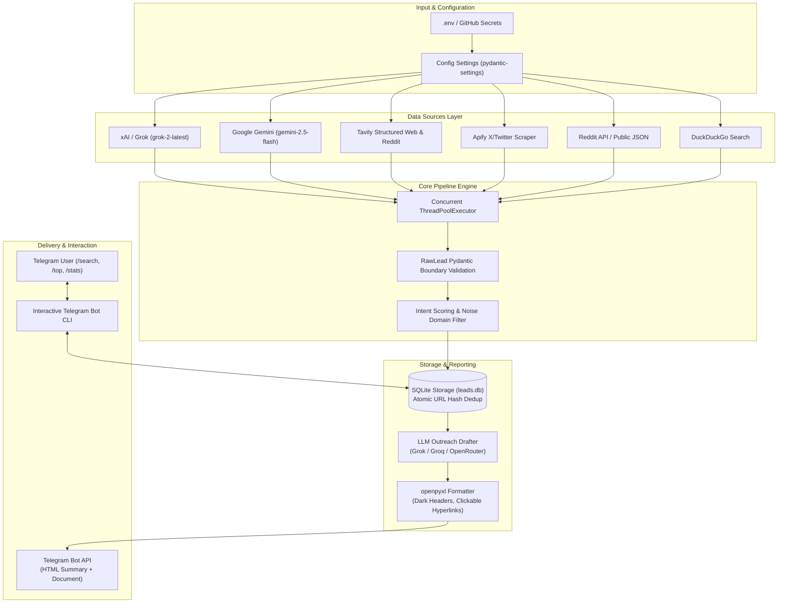
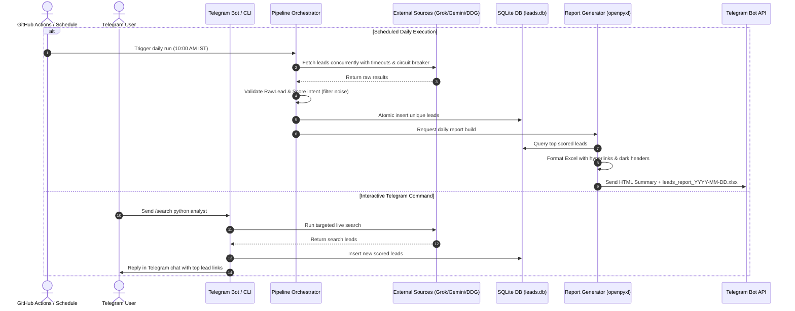

<p align="center">
  
</p>

# LeadGen - Enterprise Lead Generation Pipeline & Interactive Telegram Bot


An automated, multi-source client lead generation pipeline built for **TechNova World**. 

Discovers high-intent client opportunities across **5 core categories**, evaluates leads using custom hiring signals and noise filters, generates LLM outreach drafts, formats Excel reports with clickable hyperlinks, and delivers daily interactive summaries to Telegram.

---

## 🏛️ System Architecture



---

## 🔄 Execution Workflow



---

## 🌟 Lead Target Categories

The pipeline continuously crawls, scores, and indexes leads across 5 high-value domains:

1. **⚡ Workflow & Process Automation**: n8n, Zapier, Make.com, Python scripts, web scraping, business process automation.
2. **✍️ Freelance Writing & Copywriting**: Technical writing, SaaS documentation, copywriting, proposal writing.
3. **📊 Data Analysis & Engineering**: Python data science, SQL database analytics, Power BI, Snowflake, Tableau.
4. **📱 App Sales & Mobile App Development**: Mobile apps (React Native, Flutter), SaaS web apps, custom software contracts.
5. **🤖 AI & GenAI Engineering**: RAG pipelines, LLM token optimization, AI agent development, generative AI consulting.

---

## 🛠️ API Integrations

| Provider | Purpose | Model / Endpoint | Configuration Keys |
| :--- | :--- | :--- | :--- |
| **Google Gemini** | Free grounded Google Web search | `gemini-2.5-flash` | `GEMINI_API_KEY`, `GEMINI_MODEL` |
| **xAI / Grok** | Live X (Twitter) & web search & drafting | `grok-2-latest` | `XAI_API_KEY`, `XAI_MODEL` |
| **Tavily** | Structured web & Reddit search | `tavily-python` API | `TAVILY_API_KEY` |
| **Apify** | Twitter/X scraper Actor search | `automation-lab/twitter-scraper` | `APIFY_API_TOKEN`, `APIFY_TWITTER_COOKIE` |
| **Reddit** | Official PRAW & Public JSON scraping | PRAW / Public endpoints | `REDDIT_CLIENT_ID`, `REDDIT_CLIENT_SECRET` |
| **OpenRouter** | Outreach drafting fallback | Configurable open models | `OPENROUTER_API_KEY`, `OPENROUTER_MODEL` |
| **DuckDuckGo** | Free, no-key fallback search engine | `duckduckgo_search` / `ddgs` | Always active |

---

## 🤖 Telegram Bot Commands (`leadgen-bot`)

Run `leadgen-bot` to launch the native long-polling Telegram listener:

| Command | Usage | Description |
| :--- | :--- | :--- |
| `/super` | `/super 1 PAS` | Multi-role Super Agent (Profile ➔ Copywrite ➔ Audit ➔ Auto-Deliver) |
| `/classify` | `/classify "I want a Zoom call"` | Analyzes incoming client reply intent (CALL_REQUESTED, INTERESTED, NOT_INTERESTED) |
| `/followup` | `/followup` | Processes automated 3-day follow-up drip sequences |
| `/search` | `/search python analyst` | Performs instant live web search for leads and replies in Telegram chat |
| `/autoemail` | `/autoemail 1` | Auto-find contact email & send humanized Gmail outreach |
| `/email` | `/email 1 client@company.com` | Humanizes (0 AI slots/robotic filler) & sends 1-on-1 direct Gmail outreach |
| `/outreach` | `/outreach` | Views sent email history & delivery analytics |
| `/top` | `/top` | Displays top 5 highest-scored leads with clickable hyperlinks |
| `/stats` | `/stats` | Shows lead database statistics and count per category |
| `/report` | `/report` | Generates and sends updated Excel report on demand |
| `/help` | `/help` | Lists all available bot commands |

---

## 🤖 Advanced Automation Engine

1. **Real-Time Webhooks (`webhook.py`)**: Automatically pushes high-score leads to n8n, Make, Slack, or Discord webhooks (`WEBHOOK_URL`).
2. **AI Reply Intent Classifier (`reply_classifier.py`)**: Classifies client responses into `CALL_REQUESTED`, `INTERESTED`, `MORE_INFO`, `NOT_INTERESTED`, and `OUT_OF_OFFICE`.
3. **Automated Follow-Up Drip (`followup.py`)**: Sends 1-sentence follow-up emails after 3 days of no client reply.
4. **Tech Stack Profiler (`tech_profiler.py`)**: Profiles client technology stacks (React, Python, AWS, PostgreSQL, AI/LLMs) from lead snippets.

---

## 🔎 Multi-Source Contact Discovery Pipeline (`email_finder.py`)

Automated, 100% free multi-source email discovery engine:
1. **Direct Regex Extraction**: Scans titles & lead snippets for explicit email addresses.
2. **GitHub Contact Discovery**: Searches public GitHub profile & commit records for developer leads.
3. **DuckDuckGo Site-Specific Search**: Queries `site:<domain> "contact" OR "email" OR "mailto:"`.
4. **Free DNS MX Record Verification**: Validates domain mail servers to prevent email bounces.

---

## ⚡ Superpowers & Agent Skills Ecosystem (`superpowers.py`)

Inspired by open-source agent frameworks ([`obra/superpowers-marketplace`](https://github.com/obra/superpowers-marketplace), [`coreyhaines31/marketingskills`](https://github.com/coreyhaines31/marketingskills), and [`gstack`](https://github.com/Shweta-Mishra-ai/gstack)):

- **`TDD_VERIFIER`**: Runs automated runtime test checks before report delivery.
- **`SYSTEMATIC_REVIEWER`**: Applies multi-pass peer review for zero AI filler, anti-"Dear" greetings, and SEO/AEO/GEO alignment.
- **`GROWTH_STACK` (gstack)**: Profiles technical domain authority and API requirements for high-ticket clients.

---

## 🚀 Setup & Execution

### 1. Installation
```bash
pip install -e ".[dev]"
```

### 2. Environment Setup
```bash
cp .env.example .env
```

### 3. Running CLI Tools
```bash
# Fetch, score, and store new leads
leadgen-run

# Direct humanized Gmail outreach
leadgen-outreach --to client@company.com --lead-id 1

# Generate styled Excel report & send Telegram HTML summary
leadgen-report

# Launch interactive Telegram bot listener
leadgen-bot
```

### 4. Running Verification & Test Suite
```bash
# Run linter
ruff check src tests

# Run unit tests with coverage report
pytest --cov=leadgen --cov-report=term-missing
```

---

## 🔒 License & Copyright

**Proprietary & Confidential** — TechNova World. All Rights Reserved.  
Unauthorized copying, modification, distribution, or use of this repository is strictly prohibited.
